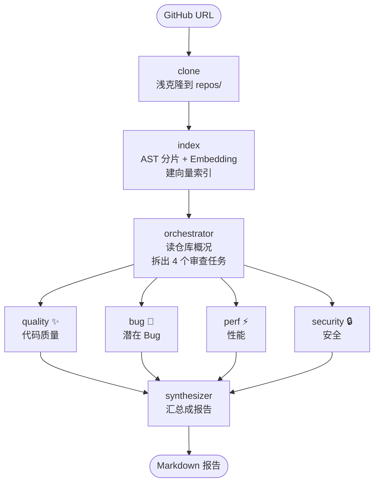

# (三)用 LangGraph 构建 Multi-Agent 代码审查系统

> 📌 文章摘要：第二周的学习目标很明确——从"手写 Agent"跨到"用框架编排Multi Agent"。这篇记录项目 2 的完整实现：输入一个 GitHub 地址，系统自动克隆、建索引，4 个审查 Agent 并行开工，最后吐出一份 Markdown 审查报告。我会讲清三件事：LangGraph 的状态怎么在节点间流动、4 个 Agent 怎么并行不打架、几十个代码文件怎么精准喂进上下文。

## 让 4 个 Agent 替我看代码，靠谱吗？

先说这事的由来。第一周我一行行手搓了一个集成 ReAct、Plan-and-Solve 的 Agent（详见[(二)我用 JavaScript 手写了一个 AI Agent，这是我学到的](https://mp.weixin.qq.com/s/Dz8QkR0GkKgbrR4RQOZ-MQ)文章），能跑，但心里没底——状态散在变量里，流程全硬编码，稍微加个分支就一团乱。

第二周换了个打法：不造轮子，上生产级框架。这也是学习计划安排的内容。

于是就有了这个项目2：**输入一个 GitHub 仓库地址，自动输出一份代码审查报告**。整个过程不用人插手，从浅克隆到建索引，再到 4 个专项 Agent 并行审查，最后汇总成一份带评分仪表盘和修复建议的 Markdown。

中间踩的坑不少，我挑最有价值的写在第五节。下面从"这周学了什么"说起。

GitHub 仓库地址：

- [AI Agent 转型 · 30 天可执行学习计划](https://github.com/superZchen0701/AI-Agent-Transformation-30-Day-Plan)：记录我每天的学习内容。
- [基于多智能体协作 + 代码 RAG 的 GitHub 仓库代码审查系统]()：项目2 GitHub 地址。

如果觉得项目有帮助，欢迎 ⭐️star 一下，我会继续完善。

### 一、第二周：从手写 Agent 到框架编排

七天拆成四块，每块都落到代码上：


*图注：第二周计划*

<br />

一周下来最大的体会是：**LangGraph 管"怎么编排"，Multi-Agent 管"怎么分工"，RAG 管"喂什么给模型"**。项目 2 就是这三件事的合体。

### 二、整体架构：一条主干 + 一次扇出

先看成品长什么样。整个流程是一条主干流水线，中间扇出成 4 路并行，最后再汇合：



为什么是"主干 + 扇出"？把每一步拆开看性质就清楚了：

- **clone → index → orchestrator 必须串行**。不克隆就没代码，不建索引就没得检索，不拆任务后面不知道审什么——三步是硬依赖。
- **4 个审查维度天然可以并行**。代码质量、Bug、性能、安全互不依赖，谁也不用等谁。
- **synthesizer 是汇合点**。等 4 路都交卷，再拼成一份报告。

这正是 Day 10 学的 **Orchestrator-Worker 模式**：一个编排者拆任务、派任务，一群 Worker 并行执行。Day 11 还学过 Supervisor 模式（让 LLM 动态决定下一个该谁上），这里我没用——审查维度是固定的 4 个，路由逻辑确定得很，不需要 LLM 插一脚。**能用确定逻辑编排的地方，就别动 LLM**，既省钱又稳定。

### 三、LangGraph 编排：Send 是怎么把 4 路并行拉起来的

LangGraph 的核心就三个概念（Day 8 的重点）：

- **State（状态）**：贯穿全图的共享数据结构，所有节点读它、写它。
- **Node（节点）**：一个函数，接收 State、返回增量更新。
- **Edge（边）**：节点之间的连线，决定下一步走谁。

我的图状态定义在 `src/graph.js`：

```js
const ReviewState = Annotation.Root({
  githubUrl: Annotation(),        // 输入
  repoPath: Annotation(),         // clone 产出
  repoName: Annotation(),         // clone 产出
  rag: Annotation(),              // index 产出的 CodeRAG 实例
  subtasks: Annotation({          // orchestrator 产出
    reducer: (_, update) => update,
    default: () => [],
  }),
  worker_results: Annotation({    // 4 个 Worker 产出
    reducer: (old, update) => [...(old || []), ...(update || [])],
    default: () => [],
  }),
  markdown: Annotation(),         // synthesizer 产出
});
```

关键在 `worker_results` 那个 **concat reducer**。4 个 Worker 并行跑完都要往这个字段写结果，如果没配 reducer，后写的会直接覆盖先写的，最后只剩 1 份。加上 concat，4 份结果自动累积成数组。

⚠️ 并行分支共享同一份 State 时，一定要给会冲突的字段配 reducer。这是 LangGraph 里最容易踩的坑之一——图能跑通，但结果悄悄少了几份，还不好查。

扇出靠 `Send`。orchestrator 跑完后，路由函数给每个子任务生成一个 `Send`：

```js
function fanoutToReviewers(state) {
  return state.subtasks.map((task) =>
    new Send('reviewerWorker', {
      task,
      rag: state.rag,   // 同一个实例引用，4 个 Worker 共享
    })
  );
}

// 条件边：orchestrator 的动态出口指向 reviewerWorker
workflow.addConditionalEdges('orchestrator', fanoutToReviewers, ['reviewerWorker']);
```

`Send` 会为每个子任务复制一份独立 State，同时把 `rag` 的引用带过去。两个好处：

1. **上下文隔离**：每个 Worker 只看得到自己的 `task`，读不到别人的中间结果，不互相干扰（正是 Day 11 强调的 Multi-Agent 关键设计）。
2. **资源共享**：`rag` 是同一个对象引用，索引只建一次，4 个 Worker 共用，不必各自重复 Embedding。

Worker 有自己的独立 schema，比主图小得多：

```js
workflow.addNode('reviewerWorker', reviewerWorker, WorkerState);
```

`WorkerState` 只需要 `task`、`rag`、`worker_results` 三个字段。用小 schema 隔离，Worker 拿不到、也不需要主图里的其他东西。

### 四、Code RAG：为什么不能把整个仓库丢给模型

这是我觉得项目里最有意思的部分。

直接把整个仓库源码塞进 prompt，两个问题立刻冒头：**一是装不下**，几十个文件轻松顶破上下文窗口；**二是注意力稀释**，就算硬塞进去，模型在几千行代码里定位问题的准确率也会掉得厉害。

Code RAG 的思路和 Day 12 学的通用 RAG 一样：**别喂全文，只喂相关的那几块**。区别在"怎么切"——通用文档按字数切，代码得按结构切。

切片逻辑在 `src/tools/code-rag.js`，两步走：

**第一步，AST 分片。** 用 `@babel/parser` 把源码解析成语法树，再按函数和类提取代码块：

```js
// 顶层函数、箭头函数、类和方法，各切一片
if (node.type === 'FunctionDeclaration') { /* 整个函数一片 */ }
else if (node.type === 'ClassDeclaration') {
  // 类整体一片，每个方法再各切一片
}
```

这样每片的语义边界都是干净的——要么是完整函数，要么是完整方法，不会把半截逻辑切到两片里去。

**第二步，兜底。** AST 只认 JS/TS 系。遇到 Python、Go 这类文件，退回按行切（60 行一片，重叠 10 行），保证不丢内容。

切完做 Embedding。我用的是智谱 BigModel 的 `embedding-3`——DeepSeek 只出 LLM 不出 Embedding，得另配一家。向量存在内存数组里，检索时算余弦相似度取 Top-K。

```
AST 解析 → 函数/类级分片 → Embedding 向量化 → 内存索引 → 余弦检索
```

跑项目 1 时，21 个文件被切成了 68 片：


*图注：21 个代码文件 → 68 个函数/类级片段，再统一向量化入库。*

最后把检索能力包成一个 Agent 能调的工具。用 `DynamicStructuredTool` + zod 定义参数，模型传一段自然语言 query，工具返回带文件路径和行号的代码片段：

```js
new DynamicStructuredTool({
  name: 'code_search',
  description: '在代码仓库中按语义检索相关代码片段……',
  schema: z.object({
    query: z.string().describe('要检索的代码内容描述，如"用户鉴权逻辑"'),
    topK: z.number().optional().describe('返回条数，默认 5'),
  }),
  func: async ({ query, topK = 5 }) => formatSearchResults(rag, query, topK),
});
```

到这里，Day 13 学的"代码感知分片 + 工具适配"就闭环了——Agent 想知道某段逻辑在哪，调 `code_search` 就行，不用全文扫描。

💡 安全阀：单仓库最多索引 200 个文件。碰到超大仓库会截断，避免把 Embedding 配额打爆。

### 五、四个审查 Agent：分工、干活、交结果

#### Orchestrator：拆任务

Orchestrator 先读仓库概况——`package.json`、README、两层目录树——再让 LLM 针对 4 个维度，各自点出最该看的文件和模块。

这里有个刻意的设计：**4 个维度写死在代码里，不让 LLM 决定**。

```js
const REVIEW_DIMENSIONS = [
  { id: 'quality',  name: '代码质量', description: '命名、注释、风格、解耦、重复代码……' },
  { id: 'bug',      name: '潜在 Bug', description: '判空、边界、异步竞态、资源泄露……' },
  { id: 'perf',     name: '性能问题', description: '算法复杂度、深拷贝、缓存缺失、N+1……' },
  { id: 'security', name: '安全风险', description: '硬编码密钥、注入、路径遍历、依赖漏洞……' },
];
```

LLM 只负责填每个维度的"重点文件"，维度本身由代码兜底。原因很简单：让 LLM 自己决定审哪几方面，它可能今天漏掉安全、明天忘了性能，覆盖度不可控。**审查这种要全面的事，框架定范围、模型填细节**，比全交给模型靠谱。

#### Reviewer：干活

4 个 Worker 跑的是同一套逻辑，差别只在 system prompt 和输出字段。每个 Worker 是一个精简的 ReAct 循环（Day 8 学的范式）：

```
1. 调 code_search 检索相关代码（围绕 focusAreas 做 2-3 次）
2. 基于检索结果，逐条过本维度的审查清单
3. 输出结构化 JSON：评分 + 问题列表（含严重度 / 文件 / 行号 / 修复建议）
```

循环有 `MAX_TURNS = 5` 的上限，防止模型在工具调用里绕不出来。

#### Synthesizer：交结果

汇总分两层，这个设计我挺满意：

1. **先用纯代码做基础汇总**：统计问题数、按 🔴 Critical / 🟡 Major / 🔵 Minor 分组、算各维度均分，拼出报告骨架（总览表 + 问题清单）。
2. **再让 LLM 补一段执行摘要**：给报告开头加上一段人能一眼看懂的总评。

分两层的好处是：**就算 LLM 挂了，报告骨架照样交得出来**。熔断降级这事第一周手写 Agent 时就该有意识，这里正好用上。

最终报告是"评分仪表盘 + 分级问题清单 + 修复建议"：


*图注：报告开头是执行摘要 + 总览仪表盘，下面按维度列出详细问题。*

### 六、跑一遍：从 URL 到报告

环境要求：Node ≥ 18、pnpm ≥ 9，外加两把 API Key（DeepSeek + 智谱）。

```bash
# 1. 装依赖
pnpm install

# 2. 配环境变量
cp .env.example .env
# 填好 DEEPSEEK_API_KEY 和 BIGMODEL_EMBEDDING_API_KEY

# 3. 跑
pnpm start https://github.com/owner/repo.git
```

启动后终端会依次打印克隆、切片、扇出、4 个 Worker 的进度：


*图注：输入仓库地址后自动浅克隆到本地 repos/ 目录。*


*图注：Orchestrator 拆出 4 个任务后扇出，4 个 Reviewer 并行开工，各自独立调 code\_search。*

最后报告落在 `reports/` 目录，标准 Markdown，可以直接丢进编辑器预览：


*图注：生成的报告带总览表格和分级明细，可直接阅读或二次编辑。*

自查清单：

- [ ] 依赖装完，`pnpm start` 能起来
- [ ] `.env` 里两把 Key 都填了（DeepSeek + 智谱）
- [ ] 克隆成功，`repos/` 下能看到目标仓库
- [ ] 索引完成，终端打印出片段数
- [ ] 报告落盘到 `reports/`，4 个维度都在

### 七、踩过的坑与几个取舍

**坑：结构化输出远比想象中脆。** 第一次拿项目 1 试跑，4 个维度里 **3 个返回了"LLM 输出解析失败"**——模型没老实吐 JSON，正则也没兜住。这直接戳破一个幻觉：**指望模型输出固定格式时，必须有解析兜底 + 重试**，否则整条链路的结果都不可信。后来的修法是加一轮"格式纠错"重试：解析失败就把上一次输出回抛给模型，只让它改格式、别改内容。

**取舍 1：固定 4 维度，不让 LLM 动态决定。** 代价是灵活性，换来覆盖度可控。审查场景里，稳定比灵活重要。

**取舍 2：RAG 实例共享，不复制。** 4 个 Worker 共用同一个 CodeRAG，索引只建一次。索引构建是大头开销（要调 Embedding），共享省下的时间很可观。

**取舍 3：报告保底。** 汇总先出代码版骨架，LLM 摘要只是锦上添花。任何一环失败，报告都不会是空的。

**取舍 4：浅克隆 + 文件数上限。** `--depth 1` 省时间，200 文件上限防配额爆炸——都是为"跑得动"让路。

### 八、写在最后

回头看这一周，从手写 ReAct 到用 LangGraph 编排 4 个 Agent，学到的其实不只是 API 怎么调，而是三件事：

1. **框架的价值在"约束"**。LangGraph 把状态流转、并行扇出、结果聚合这些容易写乱的东西变成了显式的图结构，出问题时你能一眼看出是哪个节点、哪条边的锅。
2. **Multi-Agent 不是越多越好**。Agent 数量上去，上下文管理和结果汇总的复杂度是成倍涨的。这个项目 4 个 Worker 刚好，再加就得重新想架构。
3. **LLM 是系统里最不可靠的一环**。所有依赖它输出的地方，都得有兜底、降级、重试。这一点，是这周最值钱的收获。

代码已经推到 GitHub。下一步把项目 3 的 Agent Harness 做起来——把那层"模型之外的一切"工程化。

***

*本文是 AI Agent 转型学习计划第二周的项目复盘，配套代码见 GitHub 仓库*
