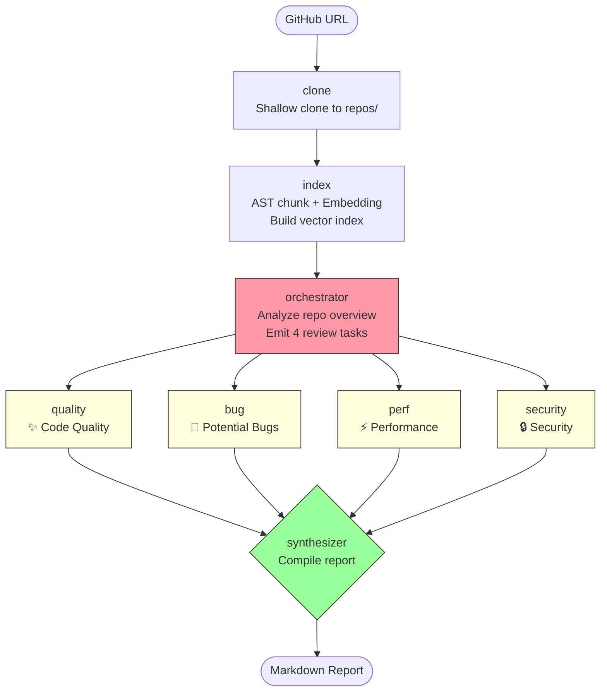

# Multi-Agent Code Review System

A GitHub repository code review system built on **LangGraph** + **Code RAG**. Input a repo URL and get an end-to-end pipeline: clone → index → 4-dimension parallel review → structured Markdown report.

## ✨ Features

- 🔀 **Multi-Agent Collaboration**: Pipeline backbone + Orchestrator-Worker fan-out. Four specialized Review Agents run in parallel.
- 🧬 **Code RAG**: AST-aware chunking + semantic vector retrieval lets Agents pinpoint relevant code instead of scanning everything.
- 🎯 **4 Review Dimensions**: Code Quality / Potential Bugs / Performance / Security — covering the most common code defects.
- 📄 **Structured Reports**: Auto-generated Markdown with score dashboard, issue lists, and fix suggestions.

## 🏗️ Architecture



### Key Design Decisions

| Module | Tech | Notes |
|--------|------|-------|
| Orchestration | `@langchain/langgraph` | StateGraph + `Send` for dynamic fan-out |
| LLM | DeepSeek Chat | Agent reasoning / review / report writing |
| Embedding | Zhipu BigModel embedding-3 | Code chunk vectorization |
| AST Chunking | `@babel/parser` | Function/class-level semantic slices |
| Vector Store | In-memory array + cosine similarity | Zero external dependencies |

### LangGraph State Flow

```
START → clone → index → orchestrator ─┬─→ reviewerWorker × 4 (parallel) → synthesizer → END
                                       │
                                       └─ concat reducer accumulates 4-way results
```

- **`Send` fan-out**: Orchestrator produces 4 subtasks at runtime; the router generates an isolated State copy for each.
- **Shared RAG instance**: `CodeRAG.buildIndex()` runs once in `indexNode`; all 4 Workers share the same in-memory vector store via a single object reference.
- **Concat reducer**: `worker_results` uses a concat reducer so parallel worker results accumulate without overwriting each other.

## 📁 Project Structure

```
.
├── src/
│   ├── index.js               # Entry point: CLI parsing + report writer
│   ├── config.js              # DeepSeek + Zhipu Embedding config
│   ├── graph.js               # LangGraph workflow assembly
│   ├── tools/
│   │   ├── git-clone.js       # GitHub shallow clone
│   │   └── code-rag.js        # AST chunking + vector index + semantic search
│   └── agents/
│       ├── orchestrator.js    # Task decomposition (fixed 4 dimensions)
│       ├── reviewer.js        # Review Worker (ReAct: tool_call → review)
│       └── synthesizer.js     # Markdown report compilation
├── reports/                   # Report output directory
├── repos/                     # Runtime-cloned repos (.gitignore)
├── .env                       # Real API keys (.gitignore)
├── .env.example               # Env var template
└── package.json               # pnpm + 10 deps
```

## 🚀 Quick Start

### 1. Install dependencies

```bash
pnpm install
```

### 2. Configure environment variables

```bash
cp .env.example .env
# Edit .env with real API keys
```

```env
# DeepSeek (Agent reasoning)
DEEPSEEK_API_KEY=sk-xxxxxxxx
DEEPSEEK_BASE_URL=https://api.deepseek.com
DEEPSEEK_MODEL=deepseek-chat

# Zhipu BigModel (Code vectorization)
BIGMODEL_EMBEDDING_API_URL=https://open.bigmodel.cn/api/paas/v4/embeddings
BIGMODEL_EMBEDDING_API_KEY=xxxxxxxx
```

### 3. Run a review

```bash
pnpm start https://github.com/superZchen0701/homework-project1-personal-agent.git
```

### 4. View the report

```bash
ls reports/
# 2026-09-23-superZchen0701-review.md
```

## 🎯 Review Dimensions

| Dimension | Focus | Checklist |
|-----------|-------|-----------|
| ✨ Code Quality | Style / Design | Semantic naming, single responsibility, SOLID, DRY, documentation |
| 🐛 Potential Bugs | Correctness | null checks, boundary conditions, async race, resource cleanup, type consistency |
| ⚡ Performance | Efficiency | O(N²) loops, object creation in loops, N+1 queries, missing caching, catastrophic regex |
| 🔒 Security Risks | Vulnerabilities | Hardcoded secrets, SQL injection, XSS/CSRF, path traversal, `eval()` dynamic code |

Per-Reviewer workflow:

```
1. Call code_search tool 2-3 times to fetch relevant code snippets
2. Walk the checklist with the dimension-specific system prompt
3. Emit structured JSON (severity 🔴🟡🔵, file path, line, fix suggestion)
```

## 🧠 Why Code RAG?

Traditional full-repo code review by LLM has two hard problems:
1. **Context window overflow** — dozens of source files blow past the model's context limit.
2. **Attention dilution** — LLM accuracy drops sharply when searching for issues across long, unstructured text.

Code RAG solves both:
```
AST parse → function/class chunks → Embedding → Vector index → Semantic search → Targeted snippets in prompt
```

- `@babel/parser` slices source into function-level blocks with clear semantic boundaries.
- Zhipu `embedding-3` vectorizes each chunk.
- Reviewers pull exactly what they need via `code_search(query, topK)`.

## 🔧 Tech Stack

| Category | Choice | Version |
|----------|--------|---------|
| Runtime | Node.js | ≥ 18 |
| Package manager | pnpm | ≥ 9 |
| LangGraph | `@langchain/langgraph` | ^1.4 |
| LangChain | `@langchain/core` / `@langchain/openai` | ^1.2 |
| AST | `@babel/parser` | ^8 |
| Schema | `zod` | ^4 |
| LLM | DeepSeek Chat | deepseek-chat |
| Embedding | Zhipu BigModel | embedding-3 |

## 📝 Report Format

```markdown
# 🔍 Code Review Report

## 🎯 Executive Summary          ← LLM-generated
## 📊 Overview                    ← Score dashboard
   | Dimension | Score | 🔴 | 🟡 | 🔵 | Total |
## 🚨 Critical Issues             ← Must-fix
## 📝 Dimension Details
   ### ✨ Code Quality
   ### 🐛 Potential Bugs
   ### ⚡ Performance
   ### 🔒 Security
## 🎯 Top Fix Priorities
```

## 📌 Notes

- Repos are cloned with `--depth 1` shallow clone for speed.
- Max 200 code files indexed per repo to avoid Embedding API quota blow-ups.
- Non-JS/TS files fall back to line-based chunking (60 lines/block, 10-line overlap).
- Empty repos / repos with no code files are guarded — no wasted Embedding calls.
- `.env` and `repos/` are in `.gitignore`.

## 📄 License

MIT
