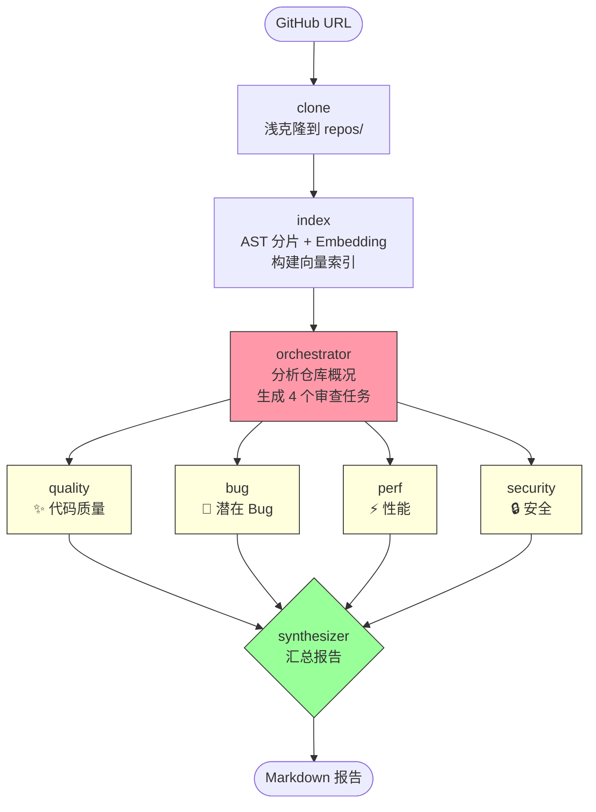

# Multi-Agent Code Review System

基于 **LangGraph** + **Code RAG** 的 GitHub 仓库代码审查系统。输入仓库地址，自动完成克隆 → 索引构建 → 四维度并行审查 → 结构化 Markdown 报告。

## ✨ 核心特性

- 🔀 **Multi-Agent 协作**：Pipeline 主干 + Orchestrator-Worker 扇出模式，4 个专属审查 Agent 并行执行
- 🧬 **Code RAG**：AST 感知分片 + 语义向量检索，让 Agent 精准定位代码片段而非全文扫描
- 🎯 **四维度审查**：代码质量 / 潜在 Bug / 性能问题 / 安全风险，覆盖最常见的代码缺陷类型
- 📄 **结构化报告**：自动生成 Markdown 格式审查报告，含评分仪表盘、问题清单、修复建议

## 🏗️ 系统架构



### 关键设计

| 模块 | 技术 | 说明 |
|------|------|------|
| 编排 | `@langchain/langgraph` | StateGraph + Send 动态扇出 |
| LLM | DeepSeek Chat | Agent 推理 / 审查 / 报告生成 |
| Embedding | 智谱 BigModel embedding-3 | 代码片段向量化 |
| AST 分片 | `@babel/parser` | 函数/类级语义切片 |
| 向量存储 | 内存数组 + 余弦相似度 | 极简自建，无外部依赖 |

### LangGraph 状态流

```
START → clone → index → orchestrator ─┬─→ reviewerWorker × 4（并行）→ synthesizer → END
                                       │
                                       └─ concat reducer 累积 4 路结果
```

- **Send 扇出**：orchestrator 运行时生成 4 个 subtask，路由函数为每个生成独立 State 副本
- **共享 RAG**：CodeRAG 实例在 index 节点构建一次，4 个 Worker 通过同一对象引用共享向量库
- **concat reducer**：`worker_results` 用 concat reducer 自动累积并行结果，避免覆盖

## 📁 项目结构

```
.
├── src/
│   ├── index.js               # 入口：命令行解析 + 报告落盘
│   ├── config.js              # DeepSeek + 智谱 Embedding 配置
│   ├── graph.js               # LangGraph 工作流组装
│   ├── tools/
│   │   ├── git-clone.js       # GitHub 浅克隆
│   │   └── code-rag.js        # AST 分片 + 向量索引 + 语义检索
│   └── agents/
│       ├── orchestrator.js    # 任务分解（固定 4 维度）
│       ├── reviewer.js        # 四维审查 Worker（ReAct: tool_call → 审查）
│       └── synthesizer.js     # Markdown 报告汇总
├── reports/                   # 审查报告输出目录
├── repos/                     # 运行时克隆的仓库（.gitignore）
├── .env                       # 真实 API Key（.gitignore）
├── .env.example               # 环境变量模板
└── package.json               # pnpm + 10 个依赖
```

## 🚀 快速开始

### 1. 安装依赖

```bash
pnpm install
```

### 2. 配置环境变量

```bash
cp .env.example .env
# 编辑 .env，填入真实 API Key
```

```env
# DeepSeek（Agent 推理）
DEEPSEEK_API_KEY=sk-xxxxxxxx
DEEPSEEK_BASE_URL=https://api.deepseek.com
DEEPSEEK_MODEL=deepseek-chat

# 智谱 BigModel（代码向量化）
BIGMODEL_EMBEDDING_API_URL=https://open.bigmodel.cn/api/paas/v4/embeddings
BIGMODEL_EMBEDDING_API_KEY=xxxxxxxx
```

### 3. 运行审查

```bash
pnpm start https://github.com/superZchen0701/homework-project1-personal-agent.git
```

### 4. 查看报告

```bash
ls reports/
# 2026-09-23-superZchen0701-review.md
```

## 🎯 审查维度详解

| 维度 | 关注点 | 检查清单 |
|------|--------|----------|
| ✨ 代码质量 | 规范 / 设计 | 语义化命名、单一职责、SOLID、重复代码、注释完整度 |
| 🐛 潜在 Bug | 正确性 | null 判空、边界条件、异步竞态、资源释放、类型一致性 |
| ⚡ 性能 | 效率 | O(N²) 算法、循环内对象创建、N+1 查询、缓存缺失、正则回溯 |
| 🔒 安全风险 | 漏洞 | 硬编码密钥、SQL 注入、XSS/CSRF、路径遍历、eval() 动态执行 |

每个 Reviewer Worker 的工作流程：

```
1. 调用 code_search 工具检索相关代码片段（2-3 次查询）
2. 基于专属 system prompt 逐条检查清单
3. 输出结构化 JSON（含严重程度分级 🔴🟡🔵、文件路径、行号、修复建议）
```

## 🧠 为什么用 Code RAG？

传统代码审查让 LLM 扫全仓库有两个硬伤：
1. **上下文装不下**——几十份源码直接爆 context window
2. **注意力稀释**——LLM 在长文本中定位问题的准确率骤降

Code RAG 的解法：
```
AST 解析 → 函数/类级分片 → Embedding → 向量索引 → 语义检索 → 精准片段塞 prompt
```

- `@babel/parser` 把源码切成函数级代码块（语义边界清晰）
- 智谱 `embedding-3` 把代码片段向量化
- Reviewer Worker 通过 `code_search(query, topK)` 精准拉取目标片段

## 🔧 技术栈

| 类别 | 选型 | 版本 |
|------|------|------|
| 语言 | Node.js | ≥ 18 |
| 包管理 | pnpm | ≥ 9 |
| LangGraph | `@langchain/langgraph` | ^1.4 |
| LangChain | `@langchain/core` / `@langchain/openai` | ^1.2 |
| AST | `@babel/parser` | ^8 |
| Schema | `zod` | ^4 |
| LLM | DeepSeek Chat | deepseek-chat |
| Embedding | 智谱 BigModel | embedding-3 |

## 📝 报告格式

```markdown
# 🔍 代码审查报告

## 🎯 执行摘要          ← LLM 生成的精炼总结
## 📊 总览               ← 评分仪表盘
   | 维度 | 评分 | 🔴 | 🟡 | 🔵 | 合计 |
## 🚨 Critical 问题       ← 必须修复
## 📝 详细审查结果
   ### ✨ 代码质量
   ### 🐛 潜在 Bug
   ### ⚡ 性能
   ### 🔒 安全
## 🎯 优先修复建议
```

## 📌 注意事项

- 仓库克隆使用 `--depth 1` 浅克隆，节省时间
- 单仓库最多索引 200 个代码文件，防止 Embedding API 爆配额
- 非 JS/TS 项目按行切块（60 行/块，10 行重叠）
- 空仓库 / 无代码文件有保护，不调 Embedding API
- `.env` 和 `repos/` 均在 `.gitignore` 中

## 📄 License

MIT
